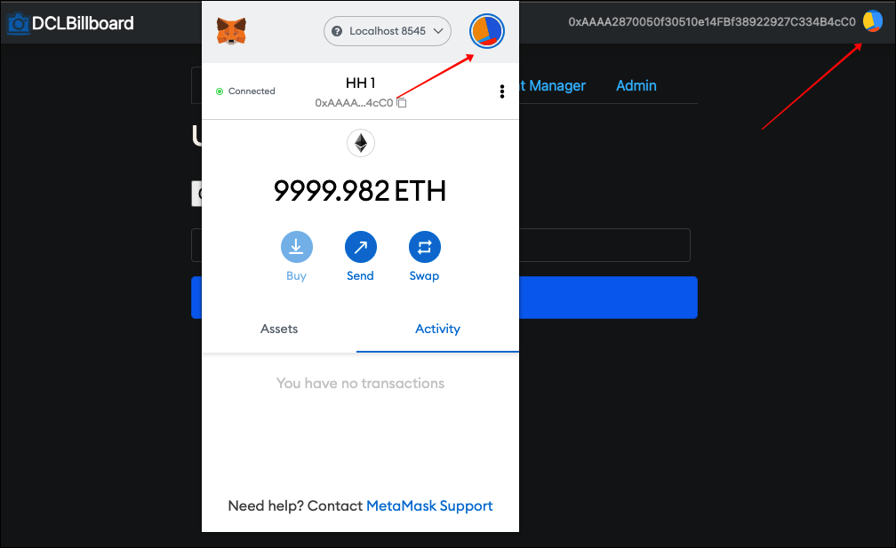
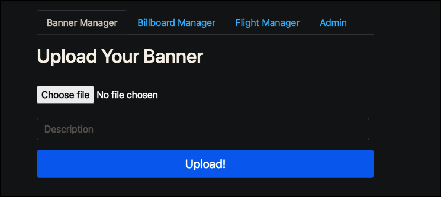
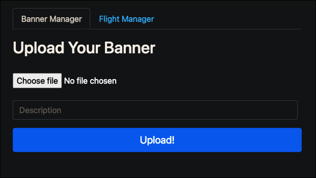
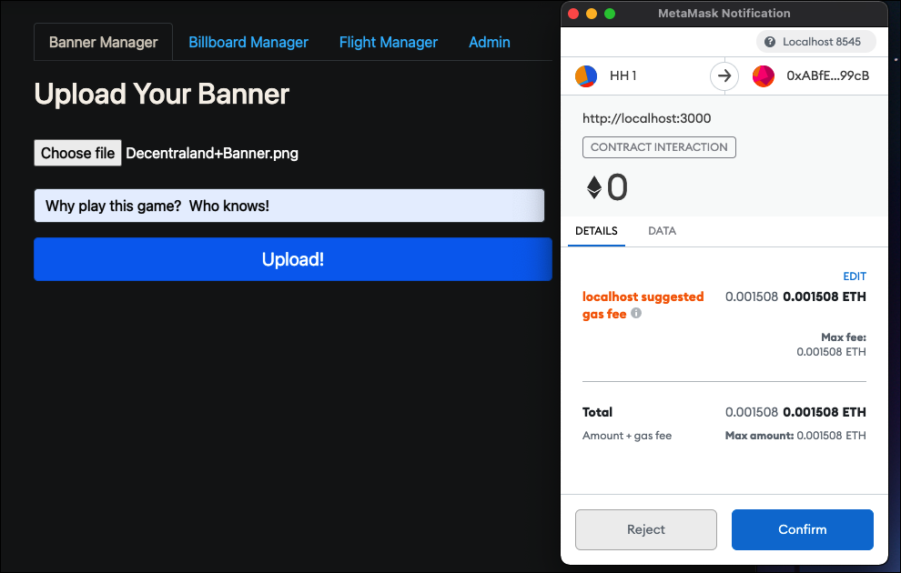
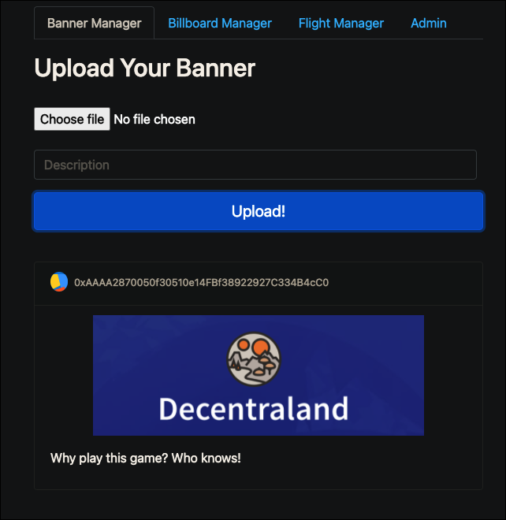
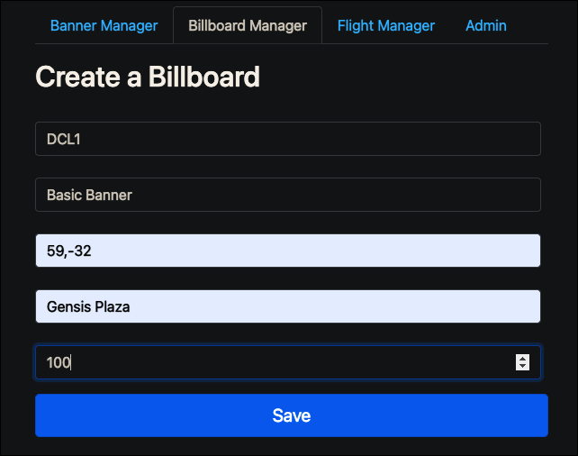
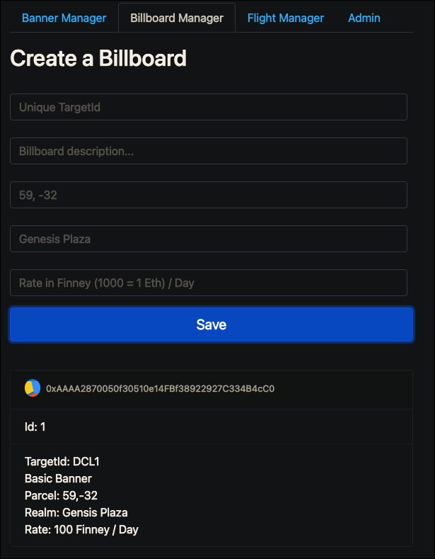
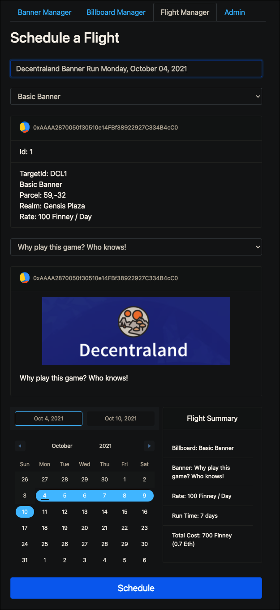
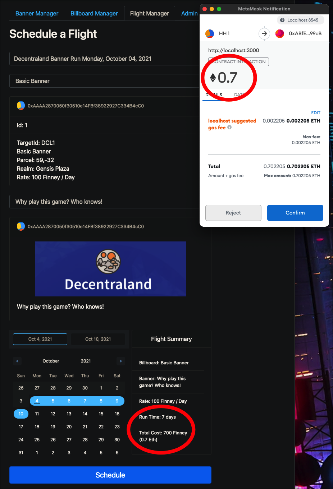
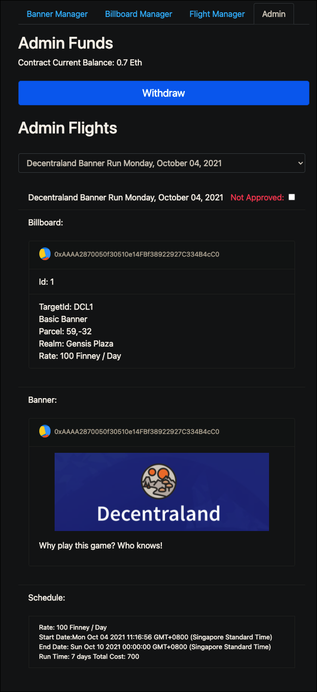

# Readme

## Summary

The DCLBillboard system is a decentralised marketing system that allows users to rent advertising space on billboards
within the Decentraland Game. Users pay with Ethereum to rent billboards on a daily basis.

## Features

* Delivery system is fully decentralise utilising the Ethereum block chain and IPFS.
* Tightly integrated with Metamask.
* Users can upload banners and store information on the blockchain .
* Land owners can deploy billboards and make available for lease.
* Land owners can specify daily lease rate for billboards.
* Customers can self schedule advertising flights choosing available billboards given a data range.
* Customers pay for the lease directly in Eth when confirming the scheduled banner advertisement, billboard and number
  of days.
* Administrator has approval over transactions.
* Administrator can transfer funds collected into a personal wallet.

## Concepts

* **Banner** - Any image that can be displayed on a billboard. The same image can be used many times.
* **[IPFS](https://ipfs-io.ipns.dweb.link/) - InterPlanetary File System** - This is where banner images are stored.
  Currently accessed via the [Infura](https://infura.io/) API.
* **Billboard** - Represents a Smart Item which can be targeted for a banner. Each one should have a unique TargetId for
  banner delivery. Descriptions, Parcel, and Location are optional attributes to manage billboards for later use. The
  Billboard's rate is in [Finney](https://eth-converter.com/extended-converter.html) per day which equates to 1/1000 of
  an Eth. Given the current cost of Eth this unit seems to be the most appropriate.
* **Flight** - A flight is a match between a banner and a billboard. It is the creation of the advertisement run for a
  given rate over a set period of time. Flights are approved by the administrator before they can run. Scheduling a
  flight costs Eth to prepay for the total run.
* **Admin** - Special user with full privileges, based on their Eth address. By default, this is the address used to
  deploy the DCLBillboard Smart Contract,

## Architecture

### DCLBillboard contract

The DCLBillboard contract holds the information for the system. This includes:

* Permissions - The addressed used to deploy the contract is automatically the administrator of the system. Other
  administrator addresses may be added and removed. See the
  OpenZeppelin [documentation](https://docs.openzeppelin.com/contracts/2.x/access-control) for more information on
  Ownership and Role-Based Access Control.

### DCLBillboard Management System

The management system is written in Node.js and React. It is not distributed; however all state is managed by the
DCLBillboard contract. Therefore, the system can be hosted anywhere, have multiple instances or be moved without any
impact on operations.

#### Metamask Integration

The system in integrated with Metamask. Whatever account is selected in Metamask, that account is used by the system. To
verify both the account address and Jazzicon in Metamask is also displayed in the DCLBillboard Manager.

#### Permissions / Security

Permissions and Security are completely based upon the Ethereum address selected in MetaMask. If the address has the
Admin role in the DCLBillboard contract, then administrative functions will be displayed. Behind the scenes, any
component marked "IsAdmin" in React, will only be rendered when the address has the "IsAdmin" role in the contract.

With Admin Address:

With Non-Admin Address:

#### Banner Manager

The Banner Manager is open to the public. Any user can upload a banner to the system. Each banner must be a valid image
file and have a description. User will pay a small Eth fee to upload the banner to the contract. Once successful, the
banner is copied to the IPFS.

#### Billboard Manager (Administrator Only)

Administrators can create any number of billboards. Each billboard should have a unqiue TargetId that will match with
the DCL Smart Item. Description, Parcel and Realm are fields used purely for front end administration and have no other
impact on the system. The rate field is used to calculate the total cost when this billboard is selected for a flight.

#### Flight Manager

Flight Manager joins an existing banner with an existing billboard over a period of time in whole days. Anyone can
register a fliight. This is the money maker! When scheduled, users must pay for the entire run of the flight in Eth.
This is calculated by the billboard rate * the number of days of the flight. Dates that are already booked for the
billboard are blocked out and not available for selection.

#### Admin

Currently, the Admin screen has two purposes. To withdraw funds from the DCLBillboard contract into the administrators
wallet and to approve flights. Only approved flights will show up on the billboard asset in DCL. Flights can also be
unapproved, however refunds are not automatic. See [Un-aproving FLights](#unapprove).

### DCL Delivery System

### Config.ts

### Billboard Listener

## Future Enhancements

### Click-thru

### Banner Size Restriction

###  Un-approving Flights

Refunds

### Expanding Smart Items

### Listening to New Flights
